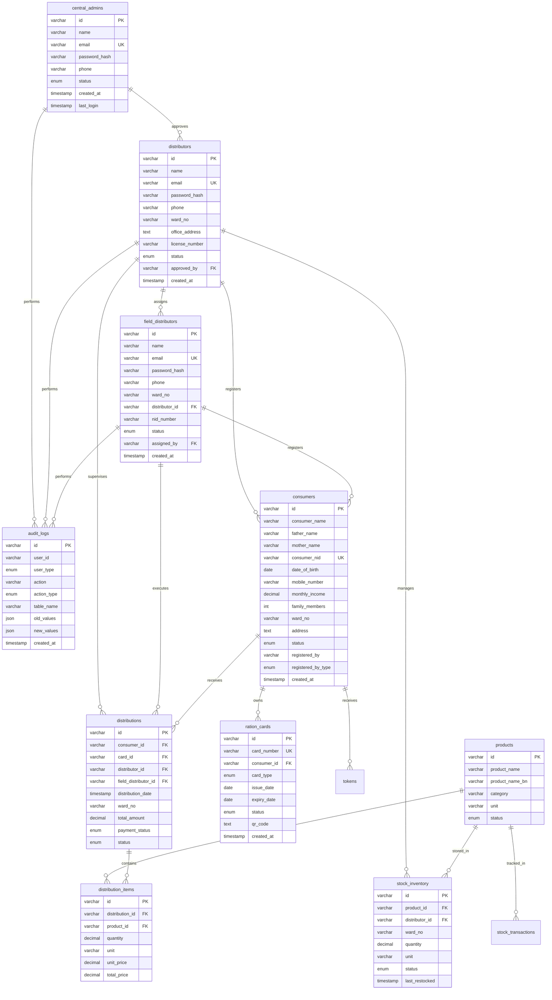

```mermaid
erDiagram
    central_admins ||--o{ distributors : "approves"
    central_admins ||--o{ audit_logs : "performs"
    
    distributors ||--o{ field_distributors : "assigns"
    distributors ||--o{ consumers : "registers"
    distributors ||--o{ stock_inventory : "manages"
    distributors ||--o{ distributions : "supervises"
    distributors ||--o{ audit_logs : "performs"
    
    field_distributors ||--o{ consumers : "registers"
    field_distributors ||--o{ distributions : "executes"
    field_distributors ||--o{ audit_logs : "performs"
    
    consumers ||--o{ ration_cards : "owns"
    consumers ||--o{ tokens : "receives"
    consumers ||--o{ distributions : "receives"
    
    products ||--o{ stock_inventory : "stored_in"
    products ||--o{ stock_transactions : "tracked_in"
    products ||--o{ distribution_items : "distributed_as"
    
    distributions ||--o{ distribution_items : "contains"
    
    central_admins {
        varchar id PK
        varchar name
        varchar email UK
        varchar password_hash
        varchar phone
        enum status
        timestamp created_at
        timestamp last_login
    }
    
    distributors {
        varchar id PK
        varchar name
        varchar email UK
        varchar password_hash
        varchar phone
        varchar ward_no
        text office_address
        varchar license_number
        enum status
        varchar approved_by FK
        timestamp created_at
    }
    
    field_distributors {
        varchar id PK
        varchar name
        varchar email UK
        varchar password_hash
        varchar phone
        varchar ward_no
        varchar distributor_id FK
        varchar nid_number
        enum status
        varchar assigned_by FK
        timestamp created_at
    }
    
    consumers {
        varchar id PK
        varchar consumer_name
        varchar father_name
        varchar mother_name
        varchar consumer_nid UK
        date date_of_birth
        varchar mobile_number
        decimal monthly_income
        int family_members
        varchar ward_no
        text address
        enum status
        varchar registered_by
        enum registered_by_type
        timestamp created_at
    }
    
    ration_cards {
        varchar id PK
        varchar card_number UK
        varchar consumer_id FK
        enum card_type
        date issue_date
        date expiry_date
        enum status
        text qr_code
        timestamp created_at
    }
    
    products {
        varchar id PK
        varchar product_name
        varchar product_name_bn
        varchar category
        varchar unit
        enum status
    }
    
    stock_inventory {
        varchar id PK
        varchar product_id FK
        varchar distributor_id FK
        varchar ward_no
        decimal quantity
        varchar unit
        enum status
        timestamp last_restocked
    }
    
    distributions {
        varchar id PK
        varchar consumer_id FK
        varchar card_id FK
        varchar distributor_id FK
        varchar field_distributor_id FK
        timestamp distribution_date
        varchar ward_no
        decimal total_amount
        enum payment_status
        enum status
    }
    
    distribution_items {
        varchar id PK
        varchar distribution_id FK
        varchar product_id FK
        decimal quantity
        varchar unit
        decimal unit_price
        decimal total_price
    }
    
    audit_logs {
        varchar id PK
        varchar user_id
        enum user_type
        varchar action
        enum action_type
        varchar table_name
        json old_values
        json new_values
        timestamp created_at
    }
```
